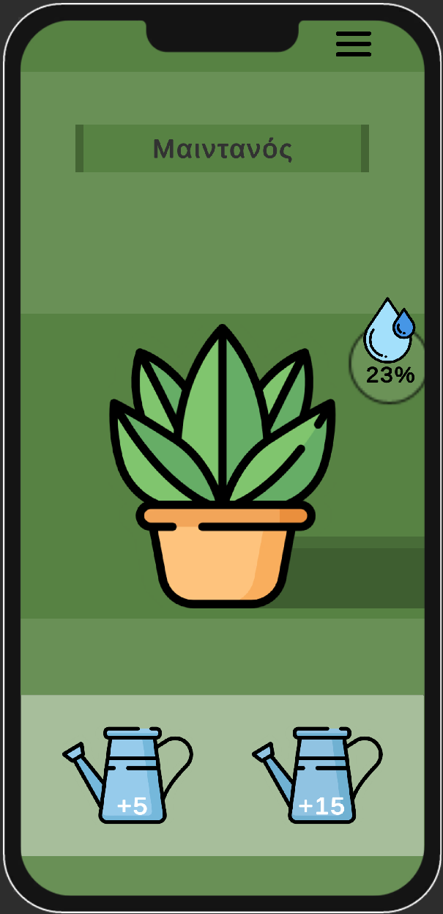
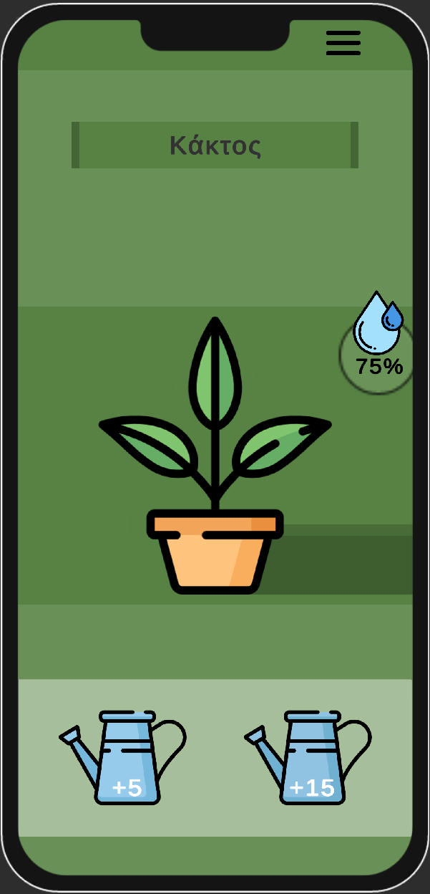

<!-- This is the README file for the github repository "https://github.com/Vafakos/Ascend" -->
<br>
<p align="center">
  
</p>

<h1 align="center">Plant-Sync</h1>

## Table of Contents

-   [Introduction](#introduction)
-   [Features](#features)
-   [Installation](#installation)
-   [Running](#running)
-   [Screenshots](#screenshots)
-   [Team](#team)

## Introduction

This project is for the course "[Smart Environments and Applications](https://github.com/riggas-ionio/smart-iot)" taught at the Ionian University Department of informatics. This repo includes an application built in Unity. It's a mobile app that shows you information about the plants you have in your space.

## Features

-   Add your plants to the app
-   Keep an eye on the hydration levels
-   Manage your watering schedule
-   Get reminders when you need to water a plant

## Installation

Step-by-step instructions on how to install and set up your project:

### Using GIT

1. Clone the repository:
    ```sh
    git clone https://github.com/yourusername/your-repo-name.git
    ```
2. Open the project in Unity:
    - Open Unity Hub
    - Click on 'Add' and select the cloned project folder

### Or Use the Download Button from GitHub

1. Go to the repository on GitHub.
2. Click on the "Code" button and then click "Download ZIP".
3. Extract the downloaded ZIP file.
4. Unzip the file
5. Open the project in Unity:
    - Open Unity Hub
    - Click on 'Add' and select the extracted project folder

## Running

You can run the project using Unity's emulator or build and run directly from your phone.

## Screenshots

<p align="center">
  
  
</p>

## Team

-   **Βαφάκος Χαράλαμπος Σωκράτης**
    -   GitHub: [Vafakos](https://github.com/Vafakos)
    -   AM: P2017015
-   **Ίωνας Φιλίππου**
    -   GitHub: [iwnasFilippou](https://github.com/iwnasFilippou)
    -   AM: P2017107
